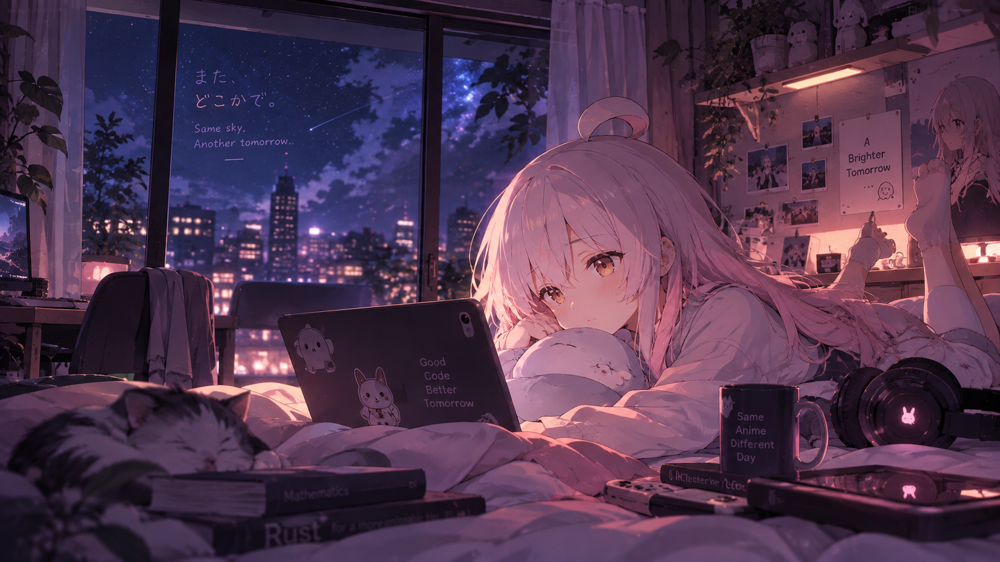
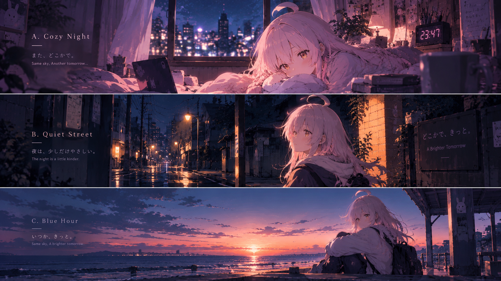

# 桌面视觉概念参考

这些图由 ChatGPT 图像生成于 2026-10-07，用户认可三个场景并决定全部保留为同主题壁纸候选。它们用于指导色彩、情绪、材质与构图，不是桌面实现截图，也不是像素级 UI 设计稿。

| 文件 | 内容 | 原始分辨率 |
| --- | --- | --- |
| [cozy-night-concept.png](cozy-night-concept.png) | A · Cozy Night：夜晚房间、蓝紫窗景、柔粉暖光 | 1672 × 941 |
| [night-scenes-triptych-concept.png](night-scenes-triptych-concept.png) | 上：A · Cozy Night；中：B · Quiet Street；下：C · Blue Hour | 整张 1672 × 941 |

## 完成的壁纸

2026-10-08 完成三张独立横屏壁纸，成品均为 3840 × 2160、16:9、sRGB PNG，保留角色偏右、暗色环境留白和局部暖光，并去掉概念图中的装饰文字。

| 场景 | 成品 |
| --- | --- |
| A · Cozy Night | [温暖卧室](../../assets/wallpapers/a-cozy-night-3840x2160.png) |
| B · Quiet Street | [雨后夜街](../../assets/wallpapers/b-quiet-street-3840x2160.png) |
| C · Blue Hour | [暮色海边](../../assets/wallpapers/c-blue-hour-3840x2160.png) |

每个场景分别通过内置图像生成工具重建构图并局部细化，生成尺寸为 1672 × 941；再使用 Real-ESRGAN 的 `realesrgan-x4plus-anime` 模型做 4 倍超分，通过 Lanczos 等比缩放与居中微量裁切适配到准确的 3840 × 2160。成品是超分 4K，不是原生 4K 生成，也不是三联图裁切放大。尺寸、制作流程及 SHA-256 见 [manifest.json](../../assets/wallpapers/manifest.json)。

这三张生成成品按用户要求纳入仓库；其他个人壁纸、本机选择路径和生成会话记录继续保留在 Git 外。

## 实施要求

- 三个场景属于同一个主题；从共同色域设计稳定 UI palette：深蓝紫／黑莓暗部、柔粉角色与高光、局部暖橙光源、灰紫连接色。
- 默认手动切换壁纸；控制中心提供三张缩略图入口，不按时间、工作区或 Codex 状态自动切换，不为每张图维护不同 UI 主题。
- 角色方向为用户喜欢的真寻。概念图的角色表现用于参考，后续成品仍应核对角色特征与用户反馈。
- 正式壁纸使用上面的三张独立 3840 × 2160 成品；三联图只作为构图参考，不作为壁纸成品。
- 图内装饰文字和生成细节不是必须保留的需求。工作区优先保证暗色留白、正文可读与人物自然受光。
- 先以这些概念图为视觉锚点完成第一阶段可交互样片，用户确认视觉后再全面迁移。

用户上传的三张外部原始参考图没有纳入仓库。本目录保存生成的概念图，独立成品保存在 `assets/wallpapers/`；不为角色或外部原作声明新的许可。

完整需求见 [TEMP-desktop-design.md](../TEMP-desktop-design.md)。
